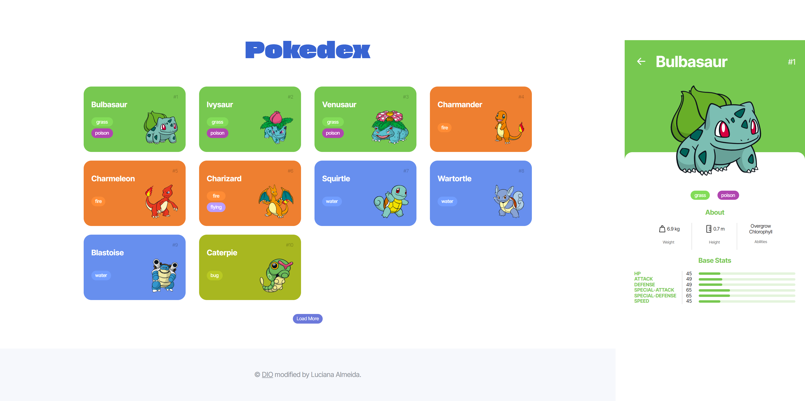

# Pokedex

Projeto desenvolvido para praticar meus conhecimentos em HTML, CSS e JavaScript consumindo a API do Pokémon.

## Tecnologias:
- HTML
- CSS
- JavaScript
- [PokéAPI](https://pokeapi.co/)

## Como executar? 
O projeto está disponível em: [vercel](https://js-pokedex-mlucianaap.vercel.app/)
